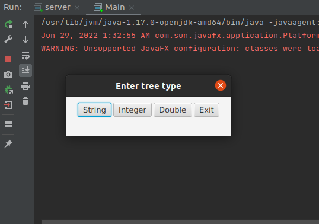
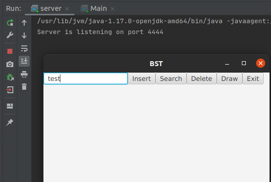
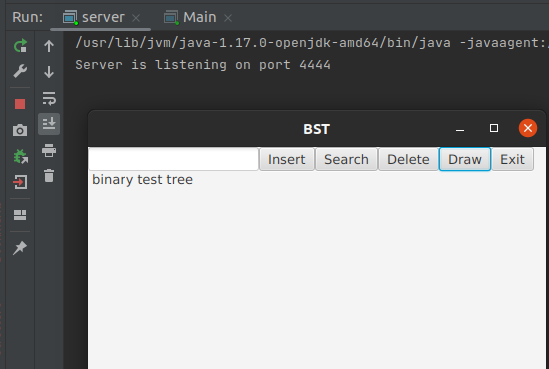

# Binary Search Tree app
> App performes all basic operations on bianry search tree.

## Table of Contents
* [Technologies Used](#technologies-used)
* [Features](#features)
* [Screenshots](#screenshots)
* [Setup](#setup)
* [Project Status](#project-status)
* [To do](#to-do)
* [Contact](#contact)

## General Information
The BST operations are performed on local server. Client request operation via GUI. There is no logic in Client app.

## Technologies Used
- Java 17
- JavaFX - 19-ea+8

## Features
List the ready features here:
- Creating BST for following types: Integer, Double and String.
- Performing operations like inserting, searching, drawing, deleting.

## Screenshots

## Setup
For fastest setup you need IntelliJ and just click run. If you don't have IntelliJ, download Java SE Development Kit 17 and Maven. All of dependencies are in pom.xml file.

Firstly You need to run method main from server class then run main from main from Main class(it starts GUI).

## Project Status
Project in progress.

## To do:
- GUI rebuild

## Contact
Created by [@MichalZurawski](https://github.com/MichalZurawski02) - feel free to contact me!
